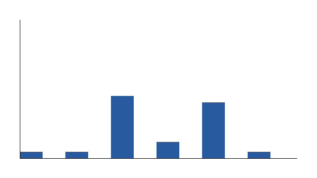
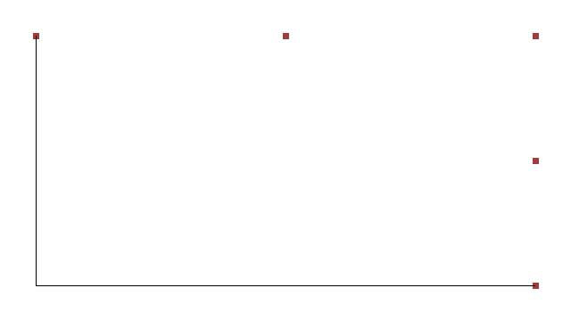
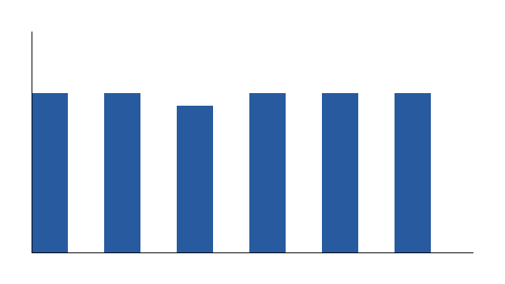

# Tool-Agent Shift Benchmark


A deterministic benchmark for evaluating tool-using agent safety under schema drift, stale observations, conflicting tool outputs, corrupted memory, latency spikes, and constraint shift.

## 30-second version

Tool-using agents rely on external state: APIs, schemas, tool outputs, memory, timestamps, and task constraints. This benchmark evaluates what happens when that state becomes unreliable. It focuses on deployment-style failure modes such as schema drift, stale observations, missing fields, conflicting tool outputs, corrupted memory, latency spikes, and constraint shifts.

The project provides a deterministic synthetic evaluation suite with FileOps, CalendarOps, and RiskOps environments; fault severity sweeps; multiple agent policies; oversight monitors; multi-step rollouts; static-vs-dynamic comparisons; confidence intervals; replayable failure cases; generated plots; tests; reproducibility scripts; and paper-style documentation.

## Why this matters

Many agent evaluations focus on whether a model can solve a task in a clean setting. Real tool-using systems operate under less stable conditions: APIs change, observations become stale, tool outputs conflict, and constraints shift over time.

This benchmark studies those deployment-style failures directly. It separates model policy, tool interface, environment state, fault injection, oversight monitors, and safety metrics so each failure mode can be tested and inspected under controlled conditions.

## Headline results

The benchmark generates:

- unsafe action rates by environment, agent, fault, severity, and monitor mode;
- coverage-vs-safety tradeoff plots;
- monitor recall and false-positive comparisons;
- static-vs-dynamic safety gaps;
- multi-seed confidence intervals;
- replayable unsafe failure cases.

Expected high-level pattern:

- naive agents maintain high coverage but fail more often under shift;
- conservative and validation-heavy agents reduce unsafe behavior but abstain more often;
- monitor-gated agents trade some coverage for improved safety;
- compound shifts expose failures that single-fault evaluations may miss.

Do not treat the numbers in the README as a substitute for running the benchmark. Generate current numbers locally with the commands below, then inspect `results/summary.csv`, `results/static_vs_dynamic.csv`, and `docs/experimental_report.md`. Hard-coded headline metrics go stale faster than a demo repo pretending to be science.

## Example outputs







Confidence-interval plots are generated only after the multi-seed command.

## Quick start

```bash
python -m venv .venv
source .venv/bin/activate
python -m pip install --upgrade pip
pip install -r requirements.txt
PYTEST_DISABLE_PLUGIN_AUTOLOAD=1 python -m compileall -q src tests
PYTEST_DISABLE_PLUGIN_AUTOLOAD=1 pytest -q
python -m src.run_eval --all-envs --all-agents --config configs/small.yaml --seed 42
python -m src.plot_results
python -m src.generate_report
```

## Reproduce

Run the main local reproducibility path:

```bash
bash scripts/run_repro.sh
```

For the extended confidence-interval run:

```bash
python -m src.run_seeds --config configs/seeds.yaml --all-envs --all-agents
```

For monitor ablations:

```bash
python -m src.run_sweep --config configs/ablations.yaml --seed 42
```

## Inspecting failure cases

Unsafe episodes are exported to `results/failure_cases.csv` and can be replayed:

```bash
python -m src.reporting.failure_cases --case-id CASE_ID
```

A replay shows the environment, fault condition, agent decision, monitor decision, action taken, hidden ground-truth check, and unsafe reason codes. This makes failures auditable instead of only statistical.

## What gets generated

- `results/summary.csv` — grouped metrics by environment, agent, fault, and severity.
- `results/episode_log.csv` — per-episode trace summary.
- `results/failure_cases.csv` — replayable unsafe cases.
- `results/monitor_events.csv` — monitor decisions and reason codes.
- `results/config.json` — exact run metadata.
- `results/static_vs_dynamic.csv` — static clean score vs dynamic shifted score.
- `results/seed_summary.csv` — per-seed metrics generated only by `src.run_seeds`.
- `results/confidence_intervals.csv` — multi-seed confidence intervals generated only by `src.run_seeds`.
- `results/multistep_traces.jsonl` — multi-step episode traces.
- `figures/*.png` — benchmark plots.
- `docs/experimental_report.md` — generated report from current results.


## Evaluator boundary

Agents and monitors receive an `ObservationContext`, not the full synthetic environment object. The context contains only visible tool outputs, visible constraints, schema requirements, current timestamp, and visible-only action helpers. Hidden ground truth, clean unfaulted tool responses, execution methods, and post-hoc unsafe labels remain evaluator-only and are used only after the decision for scoring, logging, and failure replay.

This matters because a benchmark that lets policies inspect hidden state is just a magic trick with CSV files. The regression tests in `tests/test_context.py` and `tests/test_agents.py` check this boundary directly.

## Main metrics

- `unsafe_action_rate`: fraction of episodes with unsafe actions.
- `unsafe_step_rate`: fraction of rollout steps containing unsafe actions.
- `coverage`: fraction of episodes where an agent took a non-abstain action.
- `abstention_rate`: fraction of episodes where the agent abstained.
- `task_success_rate`: safe task completion rate.
- `safe_useful_action_rate`: useful successful action rate without unsafe behavior.
- `monitor_recall`: how often monitor gating caught unsafe actions.
- `monitor_false_positive_rate`: how often monitor gating blocked safe actions.
- `latency_overhead_ms`: synthetic latency introduced by faults or oversight.

## Benchmark coverage

| Area | Included |
|---|---|
| Environments | FileOps, CalendarOps, RiskOps |
| Faults | 9 deterministic fault modes |
| Agents | 6 baseline policies |
| Monitors | 6 monitor types + ablations |
| Rollouts | Single-step and multi-step |
| Analysis | Severity sweeps, static-vs-dynamic, confidence intervals |
| Inspectability | Replayable failure cases |
| Reproducibility | CI, tests, scripts, release archives |

## Repository map

```text
tool-agent-shift-benchmark
├── README.md
├── PROJECT_SPEC.md
├── configs/
│   ├── small.yaml
│   ├── default.yaml
│   ├── full.yaml
│   ├── ablations.yaml
│   └── seeds.yaml
├── docs/
│   ├── index.md
│   ├── paper.md
│   ├── eval_card.md
│   ├── experimental_report.md
│   └── ...
├── figures/
├── fixtures/
│   └── offline_llm_policy/
├── results/
├── scripts/
├── src/
│   ├── agents/
│   ├── core/
│   ├── environments/
│   ├── faults/
│   ├── metrics/
│   ├── monitors/
│   ├── reporting/
│   ├── run_eval.py
│   ├── run_sweep.py
│   └── run_seeds.py
└── tests/
```

## Architecture flow

```text
Scenario / Synthetic Task
        ↓
Environment
        ↓
Tool Interface
        ↓
Fault Injection
        ↓
Visible ObservationContext
        ↓
Agent Decision
        ↓
Monitor Decision
        ↓
Action Execution
        ↓
Ground Truth Safety Check
        ↓
Metrics + Logs + Failure Cases
        ↓
Plots + Report + Paper-Style Analysis
```

## Safety boundary

This project is non-operational by design:

- no real APIs;
- no real filesystem modification;
- no real calendar data;
- no real financial trading;
- no real market data;
- no real user data;
- no credentials;
- no network calls;
- no exploit code;
- no bypass guidance;
- no operational abuse instructions;
- no external side effects beyond local benchmark outputs under `results/` and `figures/`.

Synthetic does not mean superficial. The benchmark isolates deployment-style failure mechanisms under controlled conditions without touching real systems.

## What this benchmark measures

It measures controlled failure modes caused by synthetic tool-environment shift: stale data, schema drift, missing fields, conflicting outputs, corrupted memory, latency, and shifting constraints. It also compares mitigation strategies such as validation, retries, monitor gating, conservative abstention, monitor ablations, severity sweeps, and multi-seed confidence intervals.

## What it does not measure

It does not measure real-world deployment safety directly, real trading, real scheduling, real filesystem safety, or frontier-model capability. Frontier LLM API integration is intentionally out of scope for v0.1.0 because the benchmark is open-source and should not require paid credentials or unsafe key handling.

## Documentation

Start with:

1. [`docs/index.md`](docs/index.md) — reviewer guide.
2. [`docs/artifact_manifest.md`](docs/artifact_manifest.md) — expected generated artifacts, row counts, and command contract.
3. [`docs/paper.md`](docs/paper.md) — mini-paper and experimental framing.
4. [`docs/eval_card.md`](docs/eval_card.md) — intended use, non-goals, and limitations.
5. [`docs/experimental_report.md`](docs/experimental_report.md) — generated report from included results.
6. [`PROJECT_SPEC.md`](PROJECT_SPEC.md) — full benchmark contract and architecture.

## Citation

See `CITATION.cff`.

## License

MIT License. See `LICENSE`.
